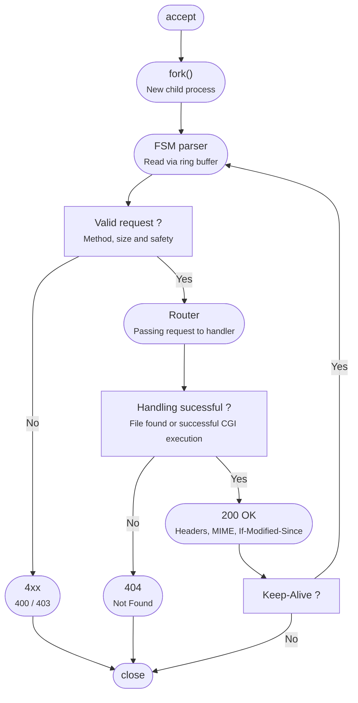
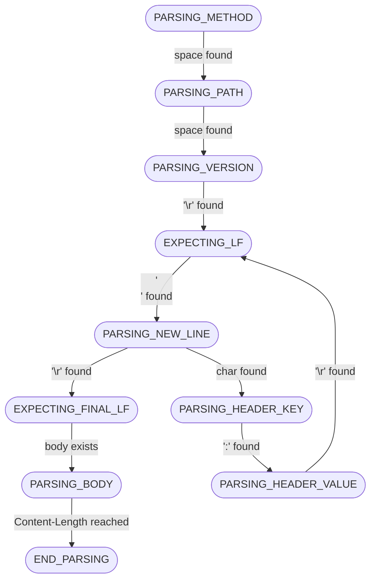

# C HTTP Server 


A low-level HTTP/1.1 server built in C from scratch. This project was developed as a deep dive into 
POSIX network programming, concurrency and robust protocol parsing.

>[!IMPORTANT]
>This project includes macOS and Linux support.
>HTTP version is **HTTP/1.1**, other versions such as HTTP/2 or HTTP/3 are not supported. 

## Main Features
- **HTTP/1.1 support** and standard status codes for GET, HEAD, OPTIONS, POST.
- **Concurrency model** : Multi-process architecture using fork() with zombie process reaping.
- **Keep-Alive support** : Efficient connection persistence using a ring buffer.
- **FSM parser** : Handles chunked requests seamlessly.
- **Full static serving** : Served with proper MIME types and `If-Modified-Since` cache support.
- **CGI support** : Using fork() and environment variables, tested on python scripts.
- **Security features** : Built-in protection against path traversal and buffer overflow.
- **Demo website** : Start the server and test it at `http://localhost:3490`.


## Build and Run 

### Prerequisites
- macOS or Linux (see [Important] notice above)
- `cc`
- `make`

### Installation 
```bash
git clone https://github.com/louis-leblondolive/http-server.git
cd http-server
```

### Compilation

The server features 2 compilation profiles :
- **`debug` (default)**: using ASan and compilation flags. Best for development and memory safety checks.
- **`release`**: compiling with optimization and without ASan. Best for benchmarks.

To compile, just type in :

```bash
make debug      # or simply 'make'
make release
```

> [!TIP]
> You can edit `src/config.h` before building to configure the port, backlog, etc.

### Run

You can run the generated binaries from the `build` directory, depending on the compilation profile you chose :

```bash
# For debuging and safety checks
./build/debug/main      

# For performance testing 
./build/release/main  
```

> [!TIP]
> Use the verbose mode (`-v`) to display debug information or the quiet mode (`-q`) to silence logs.
> (Colors supported). 

>[!NOTE]
>Because this server uses fork(), the **debug mode** might introduce a slight latency (approx. 40ms) due to ASan >overhead. For raw performance (<1ms response time), always use the **release mode**.


## Usage

Place your files in the `www/` directory. For example :

```text
www/
├── index.html
└── style.css
```

Then start the server (either on release or debug mode) :
```bash
./build/release/main
```

Open your browser at `http://localhost:3490` (or whichever port is set in `config.h`).


Your files will be accessible at `http://localhost:3490/index.html`, `http://localhost:3490/style.css`, etc.


## Technical Deep Dive

### Server General Architecture 

Request lifecycle is designed as follows : 



### Robust Request Parsing 

Instead of using fragile string splitting, this server implements a Finite State Machine. This allows the server to pause and resume whenever data is partially received over the network. 



### System Reliability & Signal Handling 

To ensure 100% uptime and clean resource management, the server implements:

- `SA_RESTART` **flags** : Prevents system calls (`accept`, `read`) from being interrupted by internal signals.
- **Atomic Signal Handlers**: Uses a non-blocking `waitpid` loop to reap child processes, preventing "zombie" accumulation.
- `errno` **Preservation**: Careful restoration of `errno` within handlers to avoid corruption of the main thread's state.

### Security & Sanitization

The server treats every input as hostile:

- **Path Sanitization**: Uses `realpath()` to resolve and verify that requested files are strictly within the `www/` jail.
- **Strict Buffer Limits**: Every parsing state (Method, URI, Headers) is guarded by customizable maximum lengths to prevent Buffer Overflow attacks.


## Repository Structure 
This repository has the following structure : 
```text

./
├── src/
│   ├── lib/
│   │   ├── http
│   │   ├── net
│   │   └── utils
│   ├── config.h
│   └── main.c
├── www/
│   ├── cgi-bin/
│   │   └── .../
│   ├── index.html
│   └── .../
├── tester/
│   ├── test_runner.py
│   └── test_suite.py
│
└── Makefile
```

- **`src`**

    This directory contains all the server code. 

    - **`lib`**  
    
        This folder contains the server code, divided in two folders : 
        - `http` where the protocol is implemented (FSM parser, Router, Response)
        - `net` where server execution and communication is handled (Socket setup and Listening loop)
        - `utils` where various tools are implemented 

    - **`config.h`** 

        This file allows you to change server parameters, including : 
        - Port and backlog
        - Server name and version 
        - Default path to use when meeting a `/`request 
        - Request size parameters  

    - **`main.c`**

        The server entry point, which should remain untouched. 

- **`tester`**

    This folder contains a Python tester used to report bugs during development. The `test_runner.py` file 
    runs all tests contained in `test_suite.py`.

- **`www`**
    
    This directory contains the static files that will be served to the client. By default, the server will try to send `www/index.html`, this can be overriden in `config.h`. 

    Place your executables in the `cgi-bin` folder.

>[!CAUTION]
>The server will try to run CGI scripts with `execl`. Make sure your scripts are either compiled or include a 
>relevant shebang.


## Tests & Benchmark 

This project includes a Python tester used throughout the development to report and correct bugs. 

### Test Categories

The following error categories were tested : 
- Basic valid requests
- Error codes correctness
- Request format (malformed, oversized requests and headers issues)
- URI edge cases (path traversal or wrong path)
- Connection handling and response format 

### Tester Usage

#### Prerequisites

```bash
python3 --version   #Python 3.13.7 or >=
pip show rich | grep Version    #Version: 15.0.0 or >= 
```
#### Usage
```bash
python3 tester/test_runner.py
```

### Benchmark
Tested with `wrk -c 100` on Macbook Air (M2). 
Requests/sec:   4477.65
Transfer/sec:     26.08MB

`fork()` causes Requests/sec to be quite low (due to memory duplication), but it also reinforces safety by isolating processes from one another.

## References
- [Beej's Guide to Network Programming](https://beej.us/guide/bgnet/)
