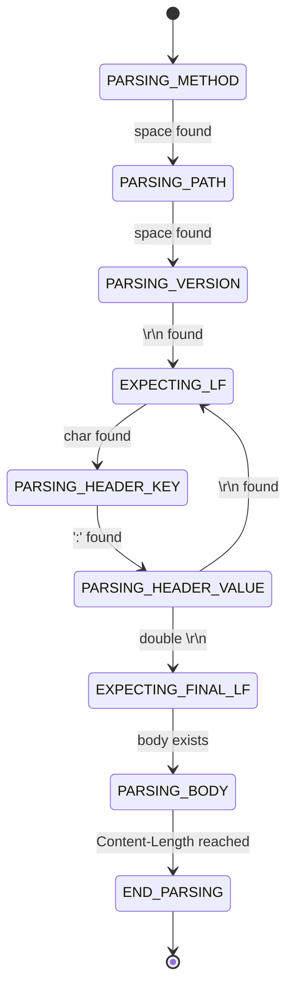

# C HTTP Server 


A low-level HTTP/1.1 server built in C from scratch. This project was developped as a deep dive into 
POSIX network programming, concurrency and robust protocol parsing.

>[!IMPORTANT]
>This project was made under macOS. Other platforms are not supported yet.
>HTTP version is **HTTP/1.1**, other versions such as HTTP/2 or HTTP/3 are not supported. 

## Main Features
- **HTTP/1.1 support** and standard status codes for GET, HEAD, OPTIONS.
- **Concurrency model** : Multi-process architecture using fork() with zombie process reaping.
- **Keep-Alive support** : Efficient connection persistence using a ring buffer.
- **FSM parser** : Handles chunked requests seamlessly.
- **Full static serving** : Served with proper MIME types and `If-Modified-Since` cache support.
- **Security features** : Built-in protection against path traversal and buffer overflow.

## Usage

Start the server :
```bash
./build/main
```

Then open your browser at `http://localhost:3490` (or whichever port is set in `config.h`).

Place your files in the `www/` directory and start the server. For example :

```text
www/
├── index.html
└── style.css
```
They will be accessible at `http://localhost:3490/index.html`, `http://localhost:3490/style.css`, etc.


## Build

### Prerequisites
- macOS (see [Important] notice above)
- `clang` or `gcc`
- `make`

### Compile
```bash
make
```

### Run
```bash
./build/main
```

> [!TIP]
> You can edit `src/config.h` before building to configure the port, backlog, etc.

## Technical Deep Dive

### Robust Request Parsing 

Instead of using fragile string splitting, this server implements a Finite State Machine. This allows the server to pause and resume whenever data is partially received over the network. 



### System Reliability & Signal Handling 

To ensure 100% uptime and clean resource management, the server implements:

- `SA_RESTART` **flags** : Prevents system calls (`accept`, `read`) from being interrupted by internal signals.
- ***Atomic Signal Handlers**: Uses a non-blocking `waitpid` loop to reap child processes, preventing "zombie" accumulation.
- `errno` **Preservation**: Careful restoration of `errno` within handlers to avoid corruption of the main thread's state.

### Security & Sanitization

The server treats every input as hostile:

- **Path Sanitization**: Uses `realpath()` to resolve and verify that requested files are strictly within the `www/` jail.
- **Strict Buffer Limits**: Every parsing state (Method, URI, Headers) is guarded by customizable maximum lengths to prevent Buffer Overflow attacks.


## Repository Structure 
This repository has the following structure : 
```text

./
├── src/
│   ├── lib/
│   │   ├── http
│   │   ├── net
│   │   └── utils
│   ├── config.h
│   └── main.c
├── www/
│   ├── index.html
│   └── .../
│
└── Makefile
```

- **`src`**

    This directory contains all the server code. 

    - **`lib`**  
    
        This folder contains the server code, divided in two folders : 
        - `http` where the protocol is implemented (FSM parser, Router, Response)
        - `net` where server execution and communication is handled (Socket setup and Listening loop)
        - `utils` where various tools are implemented 

    - **`config.h`** 

        This files allows you to change server parameters, including : 
        - Port and backlog
        - Server name and version 
        - Default path to use when meeting a `/`request 
        - Request size parameters  

    - **`main.c`**

        The server entry point, which should remain untouched. 

- **`www`**
    
    This directory contains the static files that will be served to the client. By default, the server will try to send `www/index.html`, this can be overriden in `config.h`. 


## References
- [Beej's Guide to Network Programming](https://beej.us/guide/bgnet/)
