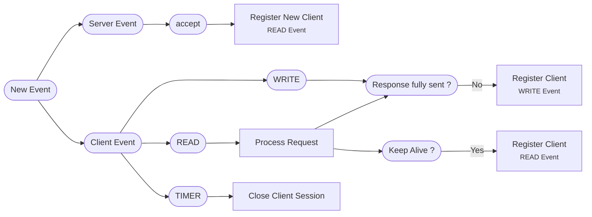
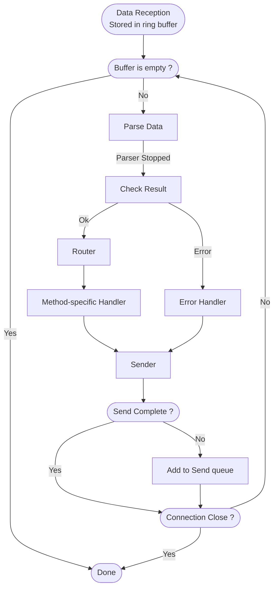
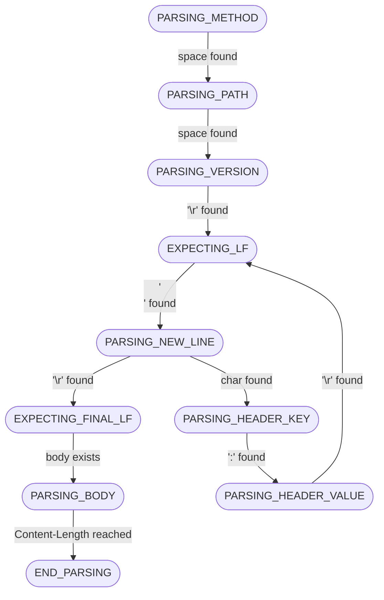

<h1 align="center">skiff</h1>
<p align="center"><i>A low level HTTP server implemented in C from scratch</i></p>

<p align="center">
  
  
  
</p>

<p align="center">
  
  
</p>


## Table of Contents
- [Main Features](#main-features)
- [Build and Run](#build-and-run)
- [Usage](#usage)
- [Architecture & Internals](#architecture--internals)
    - [Server General Architecture](#server-general-architecture)
    - [Abstract Event System](#abstract-event-system)
    - [Request Parsing](#robust-request-parsing)
    - [Response Emission Optimization](#response-emission-optimization)
    - [Security](#security)
    - [System Reliability](#system-reliability--signal-handling)
- [Tests](#tests)
- [Benchmark](#benchmark)
    - [Current Performances](#current-performances)
    - [Architectures Comparison: fork() vs. event-driven](#architectures-comparison--fork-vs-event-driven)
- [Known Limitations](#known-limitations)
- [Repository Structure](#repository-structure)
- [References](#references)


## Main Features
- **HTTP/1.1 support** and 15+ standard status codes for `GET`, `HEAD`, `OPTIONS`, and `POST`.
- **Concurrency model** : I/O multiplexing single-threaded (for now) architecture based on a `kqueue`/`epoll` abstraction.
- **Zero-copy send** : Kernel space file transfer via `sendfile()` for response optimization. 
- **Keep-Alive support** : Connection persistence using a ring buffer for allocation efficiency.
- **FSM parser** : Handling partial request reception.
- **Full static serving** : Served with proper MIME types and `If-Modified-Since` cache support.
- **CGI support** : Environment-based execution following RFC 3875 output constraints.
- **Security features** : Built-in buffer overflow protection and `realpath` based checks against path traversal.
- **Demo website** : Start the server and test it at `http://localhost:3490`.

>[!IMPORTANT]
>This project includes macOS and Linux support.
>HTTP version is **HTTP/1.1**, other versions such as HTTP/2 or HTTP/3 are not supported. 


## Build and Run 

### Prerequisites
- macOS or Linux (see [Important] notice above)
- `cc`
- `make`

### Installation 
```bash
git clone https://github.com/louis-leblondolive/skiff.git
cd skiff
```

### Compilation

The server features 2 compilation profiles :
- **`debug` (default)**: using ASan and compilation flags. Best for development and memory safety checks.
- **`release`**: compiling with optimization and without ASan. Best for benchmarks.

To compile, just type in :

```bash
make debug      # or simply 'make'
make release
```

> [!TIP]
> You can edit `include/core/config.h` before building to configure the port, backlog, etc.

### Run

You can run the generated binaries from the `build` directory, depending on the compilation profile you chose :

```bash
# For debuging and safety checks
./build/debug/skiff      

# For performance testing 
./build/release/skiff  
```

> [!TIP]
> Use the verbose mode (`-v`) to display debug information or the quiet mode (`-q`) to silence logs.
> (Colors supported). 

>[!NOTE]
>The **debug mode** might introduce a slight latency (approx. 40ms) due to ASan overhead. For better performance (<1ms response time), always use the **release mode**.


## Usage

Place your files in the `www/` directory. For example :

```text
www/
├── index.html
└── style.css
```

Then start the server (either on release or debug mode) :
```bash
./build/release/skiff
```

Open your browser at `http://localhost:3490` (or whichever port is set in `include/core/config.h`).


Your files will be accessible at `http://localhost:3490/index.html`, `http://localhost:3490/style.css`, etc.


## Architecture & Internals

### Server General Architecture 

`skiff` is based on a single threaded event-driven architecture:


```mermaid
flowchart LR
    N_evt([New Event]) 
    N_evt -->S_evt([Server Event])
    N_evt -->C_evt([Client Event])

    S_evt -->Acc([accept])
    Acc -->Reg["Register New Client"<br><small>READ Event</small>]

    C_evt -->C_R_evt([READ])
    C_evt -->C_W_evt([WRITE])
    C_evt -->C_T_evt([TIMER])

    C_R_evt -->Prcss[Process Request]
    Prcss -->Resp([Response fully sent ?]) 
    Resp -->|No|RegCW["Register Client"<br><small>WRITE Event</small>]
    Prcss -->KeepAlive([Keep Alive ?]) 
    KeepAlive -->|Yes|RegCR["Register Client"<br><small>READ Event</small>]

    C_W_evt -->Resp
    
    C_T_evt -->Close[Close Client Session]
```

The main advantage of `skiff`'s request processing logic is that both data reception and emission mechanisms are designed to be **non-blocking**. Therefore, the parser can postpone partial requests completion to future exchanges, and sending responses will not pause the server if the client socket is not ready. To do so, each client is assigned a session containing, in particular, parsing progression information and a queue for responses waiting to be sent. The request processing logic is designed as follows: 



```mermaid 
flowchart TD
    Data_Recv(["Data Reception"<br>Stored in ring buffer</br>]) 
    Empty_Buffer([Buffer is empty ?])
    Parse[Parse Data]
    Check[Check Result]
    Router[Router]
    Handler[Method-specific Handler]
    ErrHandler[Error Handler]
    Send[Sender]
    SendCPL([Send Complete ?])
    SendAddQ[Add to Send queue]
    Close([Connection Close ?])
    Done([Done])

    Data_Recv -->Empty_Buffer
    Empty_Buffer -->|Yes|Done
    Empty_Buffer -->|No|Parse
    Parse -->|Parser Stopped|Check
    Check -->|Error|ErrHandler 
    Check -->|Ok|Router
    Router -->Handler
    Handler -->Send
    ErrHandler-->Send
    Send -->SendCPL
    SendCPL -->|Yes|Close
    SendCPL -->|No|SendAddQ
    SendAddQ -->Close
    Close -->|Yes|Done
    Close -->|No|Empty_Buffer
```

An error during parsing is captured by the checker so as not to crash the entire process. 
>[!NOTE] 
>The [parsing](#robust-request-parsing) and [server response](#response-emission-optimization) mechanisms are detailed in the sections below. 


### Abstract Event System 

`skiff`'s architecture relies on an event-driven core, which required to reconcile two structurally different kernel event APIs (`kqueue` and `epoll`, respectively running on macOS and Linux) without depending on a heavy external library like `libevent`.

The core difficulty lies in how each API models a registered event:
- `epoll` maintains **one entry per file descriptor**, with a bitmask of active filters (`EPOLLIN`, `EPOLLOUT`, ...) that must be updated via `EPOLL_CTL_MOD` whenever the set of watched events changes.
- `kqueue` treats each `(ident, filter)` pair as an **independent registration** which means a single fd can have several unrelated entries (one per filter type), including filters with no fd at all, such as `EVFILT_TIMER`.

`skiff` unifies both behind a single internal interface, translating a common registration call into the appropriate platform-specific representation.

This abstraction also had to account for `EVFILT_TIMER` requiring the timeout mechanism to be modeled independently from socket I/O on macOS, whereas its Linux equivalent (`timerfd`) is file-descriptor based.


### Robust Request Parsing 

Instead of using fragile string splitting, this server implements a Finite State Machine. This allows the server to pause and resume whenever data is partially received over the network. 


```mermaid
flowchart TD
    A([PARSING_METHOD]) --> |space found| B([PARSING_PATH])
    B --> |space found| C([PARSING_VERSION])
    C --> |'\r' found| D([EXPECTING_LF])
    D --> |'\n' found| E([PARSING_NEW_LINE])
    E --> |'\r' found| F([EXPECTING_FINAL_LF]) 
    E --> |char found| G([PARSING_HEADER_KEY]) 
    G --> |':' found| H([PARSING_HEADER_VALUE])
    H --> |'\r' found| D 
    F --> |body exists| I([PARSING_BODY])
    I --> |Content-Length reached| J([END_PARSING])
```


### Response Emission Optimization

`skiff` uses two distinct emission paths depending on the response type. Static files are served through `sendfile()`, transferring data directly within kernel space without copying it into a userspace buffer. CGI and raw outputs (like errors), on the other hand, are copied through a regular buffer before being sent.

Because sends are non-blocking, a response is not guaranteed to be fully transmitted in a single call as the socket may not be ready to accept more data. When this happens, the current send state (including the file offset for `sendfile()`-based transfers) is saved and the response is pushed onto the session's send queue. The session is then registered for the `WRITE` event: each time the socket becomes writable again, the server attempts to flush the queue, repeating this process until the response is fully sent.

> [!NOTE]
> `sendfile()`'s signature differs between Linux and macOS, requiring a small platform abstraction — a much lighter one than the event queue abstraction described [above](#abstract-event-system).

### Security 

The server treats every input as hostile:

- **Path Sanitization**: Uses `realpath()` to resolve and verify that requested files are strictly within the `www/` jail.
- **Strict Buffer Limits**: Every parsing state (Method, URI, Headers) is guarded by customizable maximum lengths to prevent Buffer Overflow attacks.


### System Reliability & Signal Handling 

To ensure 100% uptime and clean resource management, the server implements:

- `SA_RESTART` **flags** : Prevents system calls (`accept`, `read`) from being interrupted by internal signals.
- **Atomic Signal Handlers**: Uses a non-blocking `waitpid` loop to reap child CGI processes, preventing "zombie" accumulation.
- `errno` **Preservation**: Careful restoration of `errno` within handlers to avoid corruption of the main thread's state.


## Tests 

`skiff` includes a Python test suite (`test/test_runner.py`) used throughout development to catch bugs and issues. It runs automatically on every push via the CI pipeline (see badges above).

### Test Categories

The suite covers 9 categories, exercising both correct behavior and edge cases:
- Valid requests (GET, HEAD, OPTIONS)
- HTTP error codes
- Malformed requests
- Size limits (method, path, headers and body tested at and beyond configured boundaries)
- Header edge cases
- URI edge cases (path traversal, oversized/malformed paths)
- Connection handling (Keep-Alive, pipelining)
- Parser edge cases (FSM boundary conditions)
- Response header correctness

> [!NOTE]
> This suite does not yet cover CGI execution or concurrent client load — see [Known Limitations](#known-limitations).

### Tester Usage

#### Prerequisites

```bash
pip install -r test/requirements.txt
```

#### Usage
```bash
python3 test/test_runner.py
```


## Benchmark

### Current Performances
`skiff` was tested with `wrk` on Macbook Air (M2). Here are the results for different numbers of opened connections (`-c`):

| Number of connections | Req/s | RAM used    | CPU Load       | Error percentage |
|-----------------------|-------|-------------|----------------|------------------|
| 1                     | 16827 | 2.5 MB      | 70.7%          | 0%               |
| 100                   | 25136 | 37.9 MB     | 95.5%          | 0%               |
| 500                   | 25305 | 58.8 MB     | 94.5%          | 0%               |
| 1000                  | 25440 | 101.9 MB    | 94.8%          | 0.2%             |
| 5000                  | 25453 | 244.3 MB    | 94.3%          | 3.2%             |
| 10000                 | 25410 | 655.0 MB    | 95.6%          | 7.4%             |
| 20000                 | 25307 | 1011.5 MB   | 94.8%          | 15.8%            |
| 30000                 | 25200 | 1548.5 MB   | 95.2%          | 23.5%            |

The req/s rate remains steady, even when the number of simultaneous connections rises above 10K, a good sign for the C10K problem were it not for the `connect` error rates. The nearly full CPU load, measured with `htop` for the sole `skiff` process, suggests that the server bottleneck is request processing rather than syscalls. As several requests can be handled in parallel, a multithreaded architecture would improve performances and is planned for upcoming versions. 

The test is biased by the OS file descriptor and sockets limit (left at its default value), as demonstrated by the climbing error rate and `wrk` reporting the errors as connect socket errors. 


### Architectures Comparison : fork() vs. event-driven

Before migrating to the event-driven model, `skiff` used a fork-per-connection architecture. A direct comparison at `-c 100` illustrates the impact of the migration:

| Architecture     | Req/s     | Transfer/s |
|-------------------|-----------|------------|
| fork() (legacy)   | 4,477.65  | 26.08 MB   |
| Event-driven       | 25,136    | ~146 MB   |

Event-driven throughput at the same concurrency level is roughly **5.6x** higher.

> [!NOTE]
> Memory usage for the fork() version could not be reliably measured: under load, the server spawns a large number of short-lived child processes, and no consistent sampling method was available to sum their combined RSS at capture time. This measurement difficulty is itself indicative of a structural downside of the fork-per-connection model. 


## Known Limitations

- **Multiple `send()` calls instead of `writev()`**: response status, headers and body are currently sent through separate `send()` calls rather than a single `writev()`, resulting in more syscalls than necessary per response.
- **Blocking CGI pipe read**: the pipe connected to a CGI script's output is read synchronously rather than being registered in the event queue. Since `skiff` is single-threaded, a slow or hanging CGI script blocks the entire event loop. Moving to a multithreaded model (see [Current Performances](#current-performances)) could serve as an intermediate solution, isolating a blocking CGI read to a single thread instead of stalling the whole server (though registering the CGI pipe in the event queue remains the more direct fix.)
- **Manual, non-exhaustive testing**: the Python test suite (`test/test_runner.py`) covers HTTP correctness (valid requests, error codes, malformed input, size limits, header edge cases, URI handling, connection behavior, parser edge cases, response headers), but does not yet cover CGI execution, partial request reception or concurrent client load. Those were still validated manually during development, but not through automated regression tests. 

## Repository Structure 
This repository has the following structure : 
```text

./
├── src/
│   ├── core/
│   │   ├── event/
│   │   ├── main.c
│   │   └── reactor.c
│   ├── ds/
│   ├── http/
│   │   ├── ds/
│   │   ├── parser/
│   │   ├── router/
│   │   ├── handler/
│   │   └── responder/
│   ├── net/
│   └── utils/
|
├── include/
|
├── www/
│   ├── cgi-bin/
│   │   └── .../
│   ├── index.html
│   └── .../
|
├── test/
|   ├── bench.sh
│   ├── test_runner.py
│   └── test_suite.py
│
└── Makefile
```

- **`src`**

    This directory contains all the server source code. 

    - **`core`**  
    
        This folder contains `skiff`'s core code, including:
        - `event/` where the event queue API is implemented for both macOS and Linux.
        - `reactor.c` containing the server main event loop
        - `main.c`, the server entry point, which should remain untouched. 

    - **`http`**

        This folder contains the HTTP protocol implementation: 
        - The `ds` folder contains the various data structures used for sessions, requests and responses. 
        - The `parser`, `router`, `handler` and `responder` folder contains the implementation of the corresponding operation. 

    - **`net`**

        This folder is where server communication is handled (Socket setup and `sendfile()` abstraction)

    - **`ds`**

        This folder contains generic data structures used during execution (such as the ring buffer implementation).

    - **`utils`**

        This folder contains the implementation of various tools (e.g. a custom printer or an IP address converter)

- **`include`**

    This folder follows the same structure as `src`, but with headers instead of `.c` files. A notable file is **`core/config.h`** that allows you to change server parameters, including : 
        - Port and backlog
        - Server name and version 
        - Default path to use when meeting a `/`request 
        - Request size parameters  

        
- **`test`**

    This folder contains a Python tester used to report bugs during development. The `test_runner.py` file 
    runs all tests contained in `test_suite.py`. It also contains a benchmark script (`bench.sh`) relying on `wrk`.

- **`www`**
    
    This directory contains the static files that will be served to the client. By default, the server will try to send `www/index.html`, this can be overriden in `config.h`. 

    Place your executables in the `cgi-bin` folder.

>[!CAUTION]
>The server will try to run CGI scripts with `execl`. Make sure your scripts are either compiled or include a 
>relevant shebang.


## References
- [Beej's Guide to Network Programming](https://beej.us/guide/bgnet/)
- [RFC 9112 - HTTP/1.1](https://datatracker.ietf.org/doc/html/rfc9112)
- [The C10K Problem](https://www.kegel.com/c10k.html)